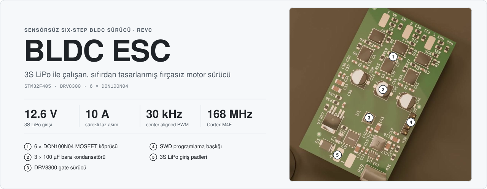
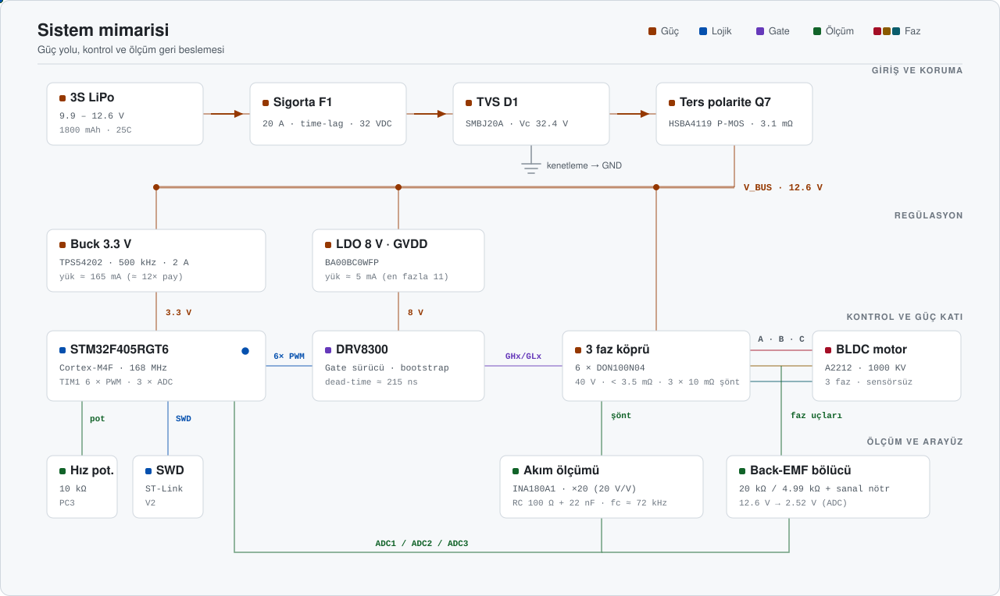
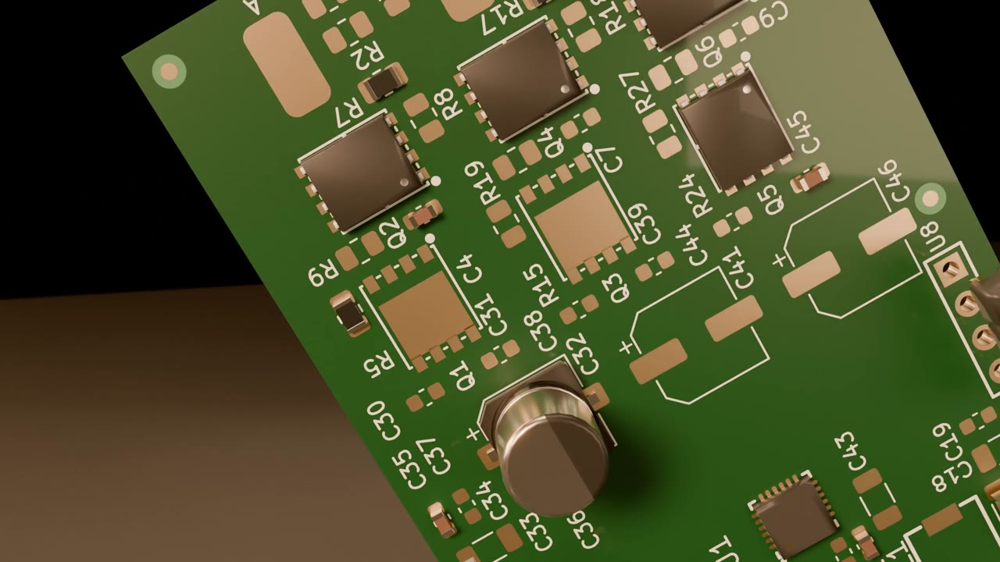
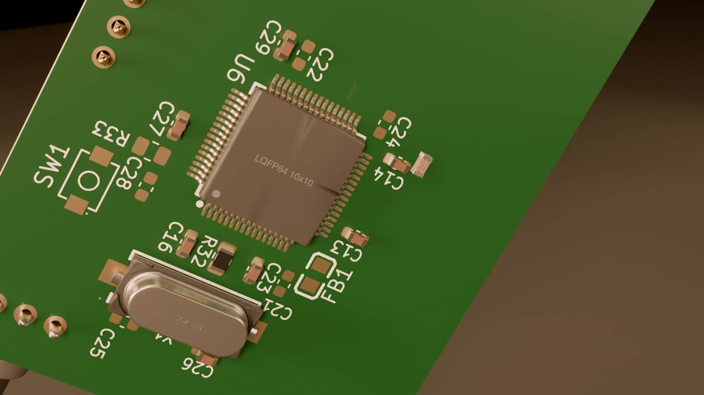
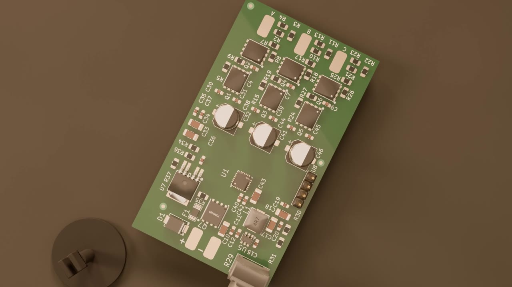

<div align="center">



<br/>

<a href="#-donanım"></a>
<a href="#-donanım"></a>
<a href="#-pcb"></a>


<br/><br/>

**Sıfırdan tasarlanmış bir fırçasız DC (BLDC) motor sürücüsü.**<br/>
Hall sensörü olmadan, boştaki fazın back-EMF sıfır geçişini okuyarak rotor konumunu tahmin eder.

<br/>

<a href="assets/pcb-render.mp4">
  
</a>

<sub>PCB'nin Blender'da hazırlanmış 3D render'ı · tam çözünürlüklü video için görsele tıklayın</sub>

</div>

<!--
  ────────────────────────────────────────────────────────────────────────────
  OYNATILABİLİR VİDEO (isteğe bağlı)
  GitHub, repodaki .mp4 dosyalarını README içinde oynatıcı olarak GÖSTERMEZ.
  Oynatıcı istiyorsanız:
    1) GitHub'da README.md'yi web editöründe açın (kalem simgesi).
    2) assets/pcb-render.mp4 dosyasını editöre sürükleyip bırakın.
    3) Oluşan https://github.com/user-attachments/assets/... satırını
       aşağıdaki "VIDEO_LINKI_BURAYA" satırının yerine koyun (tek başına, kendi satırında).
    4) Bu yorum bloğunu silebilirsiniz.
  ────────────────────────────────────────────────────────────────────────────
-->

<!-- VIDEO_LINKI_BURAYA -->


## İçindekiler

- [Genel bakış](#-genel-bakış)
- [Öne çıkanlar](#-öne-çıkanlar)
- [Sistem mimarisi](#-sistem-mimarisi)
- [Six-step komütasyon](#-six-step-komütasyon)
- [Donanım](#-donanım)
- [Tasarım hesapları](#-tasarım-hesapları)
- [Pin haritası](#-pin-haritası)
- [PCB](#-pcb)
- [Malzeme listesi](#-malzeme-listesi)
- [Depo yapısı](#-depo-yapısı)

## ◆ Genel bakış

Bu proje, bir **A2212 1000 KV** fırçasız motoru **3S LiPo** batarya ile sürmek için tasarlanmış bir ESC'dir (Electronic Speed Controller). Kart; güç girişi koruması, iki ayrı regülatör, 3 fazlı MOSFET köprüsü, faz başına bağımsız akım ölçümü, back-EMF algılama ve bir **STM32F405** mikrodenetleyiciyi tek bir PCB üzerinde topluyor.

Tasarımdaki her değer bir hesaba dayanıyor: MOSFET seçiminden bootstrap kondansatörüne, dead-time'dan ferrit bead bastırma oranına kadar kararların gerekçesi [Tasarım hesapları](#-tasarım-hesapları) bölümünde; tüm türetimler adım adım [Hesaplama Notları](Hesaplama%20Notları.pdf) dosyasında.

| Özellik | Değer |
|---|---|
| **Kontrol yöntemi** | Sensörsüz six-step (trapezoidal), back-EMF sıfır geçişi |
| **Giriş gerilimi** | 3S LiPo · 11.1 V nominal · 12.6 V maksimum |
| **Faz akımı** | 10 A sürekli · 12 A tepe (tasarım hedefi) |
| **Anahtarlama** | 30 kHz, center-aligned PWM, ~11.4 bit duty çözünürlüğü |
| **Dead-time** | 2 katman: TIM1 DTG ≈ 1 µs + DRV8300 sabit ≈ 215 ns (tipik) |
| **Akım ölçümü** | 3 × low-side şönt (10 mΩ) + 3 × INA180A1 (20 V/V), eşzamanlı örnekleme |
| **Hız ayarı** | Panel montaj 10 kΩ potansiyometre |
| **Programlama** | SWD (ST-Link V2) |

## ◆ Öne çıkanlar

<table>
<tr>
<td width="50%" valign="top">

**Katmanlı giriş koruması**<br/>
TVS diyot (SMBJ20A, 32.4 V clamp), 20 A SMD sigorta ve P-kanal ters polarite MOSFET. Hot-plug ve anahtarlama kaynaklı gerilim darbelerine karşı koruma.

</td>
<td width="50%" valign="top">

**Faz başına eşzamanlı akım ölçümü**<br/>
Üç şönt akımı üç ayrı ADC'ye dağıtıldı (ADC1/2/3) ve her birinde **Rank 1** kanalı. TIM1 CH4 tetiklediği anda üç faz aynı anda örnekleniyor, fazlar arası zaman kayması yok.

</td>
</tr>
<tr>
<td valign="top">

**Isıl hesabı yapılmış MOSFET seçimi**<br/>
DON100N04 (40 V, < 3.5 mΩ, **Q<sub>g</sub> ≈ 40 nC** @ 10 V). 10.5 A'de MOSFET başına ≈ 0.39 W (25 °C); sıcakken (4.46 mΩ) ≈ 0.49 W ve 40 °C ortamda T<sub>J</sub> ≈ 65 °C. Bu kartta tek MOSFET'in ısıl sınırı ≈ 22 A.

</td>
<td valign="top">

**Temiz analog besleme**<br/>
VDDA hattı ferrit bead + 100 nF + 1 µF ile buck ripple'ından ayrıldı. 500 kHz'de tahmini **30–60 kat (%97–98) bastırma**. ADC referansı ve CSA beslemesi aynı hattan: ölçüm oransal (ratiometric).

</td>
</tr>
<tr>
<td valign="top">

**Hesaplanmış bootstrap**<br/>
C<sub>BOOT,min</sub> ≈ 47 nF (TI'ın 1 V dalgalanma kuralı), seçilen 100 nF ile **~2× pay** ve ≈ 0.47 V dalgalanma. Üst kol kesintisiz açık kalamayacağı için %100 duty kullanılmıyor.

</td>
<td valign="top">

**Sanal nötr ile back-EMF algılama**<br/>
Faz başına 20 kΩ / 4.99 kΩ bölücü 12.6 V'u ≈ 2.52 V'a indiriyor; 3 × 20 kΩ + 1.65 kΩ'luk sanal nötr aynı ölçekte (sapma ≈ %0.7). Boştaki fazın nötrü kestiği an sıfır geçişi.

</td>
</tr>
</table>

## ◆ Sistem mimarisi

<p align="center">
  
</p>

Güç yolu soldan sağa akıyor: batarya, sırasıyla sigorta (F1), TVS diyodu (D1) ve ters polarite MOSFET'inden (Q7) geçip `V_BUS` barasına ulaşıyor. Bu baradan üç kol ayrılıyor:

- **TPS54202 buck** → 3.3 V (MCU, CSA'lar, potansiyometre) · 500 kHz senkron
- **BA00BC0WFP LDO** → 8 V GVDD (DRV8300 gate sürme beslemesi) · ≈ 5 mA tipik, en fazla ≈ 11 mA yük
- **3 faz köprü** → motor fazları A / B / C

STM32, TIM1'in 6 tamamlayıcı PWM çıkışıyla DRV8300'ü sürüyor; DRV8300 de bootstrap üzerinden üst kol N-kanal MOSFET'lerin gate'lerini bara geriliminin üstüne taşıyor.

## ◆ Six-step komütasyon

<p align="center">
  
</p>

Her elektriksel periyot altı adıma bölünüyor. Her adımda **iki faz aktif** (biri üst koldan PWM'leniyor, diğeri alt koldan sürekli iletimde), **üçüncü faz boşta** kalıyor. Boştaki fazın back-EMF'i sanal nötr seviyesini kestiği anda (sıfır geçişi) rotorun konumu biliniyor ve bir sonraki adıma geçiş zamanlanıyor.

| Adım | 1 | 2 | 3 | 4 | 5 | 6 |
|:--|:-:|:-:|:-:|:-:|:-:|:-:|
| **Üst kol (PWM)** | A | A | B | B | C | C |
| **Alt kol (açık)** | B | C | C | A | A | B |
| **Boşta (BEMF ölçümü)** | C | B | A | C | B | A |

> [!NOTE]
> Motor dururken back-EMF olmadığı için sensörsüz kontrolde **açık döngü başlatma** (open-loop ramp) gerekiyor. Motor yeterli hıza ulaşıp BEMF okunabilir hale geldiğinde kapalı döngüye geçiliyor.

## ◆ Donanım

<details open>
<summary><b>Güç katı</b></summary>
<br/>

| Blok | Parça | Not |
|---|---|---|
| Yarım köprü MOSFET'leri | 6 × **DON100N04** (DFN-8) | 40 V · < 3.5 mΩ · Q<sub>g</sub> ≈ 40 nC · gövde diyodu yeterli, harici Schottky yok |
| Gate dirençleri | 6 × 15 Ω | TI referans tasarımı ve bağımsız hesapla doğrulandı |
| Gate pull-down | 6 × 10 kΩ | Self turn-on koruması |
| Faz kondansatörleri | Faz başına 100 µF + 1 µF + 100 nF | Bulk + decoupling |

</details>

<details>
<summary><b>Gate sürücü — DRV8300</b></summary>
<br/>

- DT pini boşta (ya da GND'de): dahili dead-time ≈ 215 ns (tipik, datasheet)
- Bootstrap: 100 nF, entegre bootstrap diyodu
- GVDD: 8 V LDO çıkışı
- nFAULT çıkışı yok → donanımsal aşırı akım kesmesi (BKIN) yok; akım, şönt + INA180 zinciriyle ölçülüyor

</details>

<details>
<summary><b>Akım ölçümü</b></summary>
<br/>

- 3 × **10 mΩ / 3 W** şönt (2512), alt kol altında (low-side)
- 3 × **INA180A1** (20 V/V) — 12 A'de 2.4 V çıkış
- Çıkışta 100 Ω + 22 nF RC filtre (f<sub>c</sub> ≈ 72 kHz)
- 12-bit ADC ile çözünürlük ≈ **4 mA / LSB**

</details>

<details>
<summary><b>Back-EMF algılama</b></summary>
<br/>

- Faz başına bölücü: 20 kΩ / 4.99 kΩ → 12.6 V faz geriliminde **≈ 2.52 V** ADC girişi
- Sanal nötr: 3 × 20 kΩ yıldız + 1.65 kΩ (R<sub>n</sub> = R<sub>alt</sub>/3) → faz bölücüleriyle aynı ölçek
- Tüm dirençler ±%1; ölçek sapması ≈ %0.7

</details>

<details>
<summary><b>Mikrodenetleyici — STM32F405RGT6</b></summary>
<br/>

- Cortex-M4F · 168 MHz · 1 MB Flash · 192 KB RAM · FPU
- 8 MHz HSE kristal, 2 × 30 pF yük kondansatörü (C<sub>L</sub> = 20 pF)
- VCAP1/2: 2 × 2.2 µF X5R
- 4 × VDD'ye ayrı 100 nF, VBAT → 3.3 V + 100 nF
- NRST: 100 nF + tact switch · BOOT0: 10 kΩ ile GND
- SWD: 4 pinlik 2.54 mm header (3.3 V, SWDIO, SWCLK, GND)

</details>

<details>
<summary><b>Göstergeler (LED)</b></summary>
<br/>

| LED | Görev | Sürüş | Akım |
|---|---|---|---|
| LED1 | Güç göstergesi | 3.3 V → R38 (200 Ω) → LED1 → GND | ≈ 6.5 mA |
| LED2 | SWD aktivite göstergesi | 3.3 V → R39 (200 Ω) → LED2 → Q8 (MMBT5551, low-side) · baz SWCLK'ten R40 (10 kΩ) ile | ≈ 6.5 mA |

- LED2, debugger bağlıyken SWCLK üzerindeki trafikle yanıp söner; MCU pini harcamaz.
- Q8'in baz akımı ≈ 0.26 mA — SWCLK hattını anlamlı ölçüde yüklemez.

</details>

## ◆ Tasarım hesapları

<details>
<summary><b>MOSFET seçimi</b></summary>
<br/>

$$V_{DS} \geq 2 \times V_{\text{bara,max}} = 2 \times 12.6\text{ V} = 25.2\text{ V} \quad\Rightarrow\quad 40\text{ V sınıfı}$$

$$I_D \geq 3 \times I_{\text{çalışma}} = 3 \times 10\text{ A} = 30\text{ A} \quad\Rightarrow\quad \text{DON100N04: 100 A}$$

İletim kaybı, 25 °C'de $R_{DS(on)} \leq 3.5\text{ m}\Omega$ ile:

$$P = I^2 \times R_{DS(on)} = 10.5^2 \times 0.0035 \approx 0.39\text{ W}$$

Asıl karar ısıl hesapla verilir. Sıcakken (150 °C) direnç ≈ 4.46 mΩ, R<sub>θJA</sub> = 50 °C/W ve T<sub>A</sub> = 40 °C ile:

$$P = 10.5^2 \times 0.00446 \approx 0.49\text{ W} \quad\Rightarrow\quad T_J = T_A + P \times R_{\theta JA} = 40 + 0.49 \times 50 \approx 65\text{ °C}$$

$$I_{max} = \sqrt{\frac{(150 - 40)/50}{0.00446}} = \sqrt{\frac{2.2\text{ W}}{0.00446\ \Omega}} \approx 22\text{ A}$$

Yani bu kartta tek bir MOSFET'in sürekli taşıyabileceği akım datasheet'teki 100 A değil, yaklaşık 22 A'dir; 10.5 A çalışma noktası bunun çok altındadır.

</details>

<details>
<summary><b>Bootstrap kondansatörü</b></summary>
<br/>

$$\Delta V_{BST} = V_{GVDD} - V_{BOOTD} - V_{BSTUV} = 8 - 0.85 - 4.5 = 2.65\text{ V}$$

$$Q_{tot} = Q_g + \frac{I_{LBS,TRAN}}{f_{sw}} = 40\text{ nC} + \frac{220\ \mu\text{A}}{30\text{ kHz}} \approx 47\text{ nC}$$

TI, kondansatör üzerindeki çevrim başına dalgalanmanın 1 V'u geçmemesini öneriyor:

$$C_{BOOT,min} = \frac{Q_{tot}}{1\text{ V}} \approx 47\text{ nF} \quad\Rightarrow\quad 100\text{ nF seçildi (yaklaşık 2 kat pay)}$$

100 nF ile dalgalanma $47\text{ nC} / 100\text{ nF} \approx 0.47\text{ V}$, yani 2.65 V'luk sınırın çok altında. GVDD tarafında kural $C_{GVDD} \geq 10 \times C_{BOOT} = 1\ \mu\text{F}$; datasheet GVDD pininde ayrıca en az 10 µF istiyor (C43 = 10 µF, C40 = 1 µF, C42 = 100 nF).

Üst kolun kesintisiz açık kalabileceği süre, 150 µA'lik statik sızıntıyla $2.65\text{ V} \times 100\text{ nF} / 150\ \mu\text{A} \approx 1.8\text{ ms}$ (≈ 53 PWM periyodu). Bu yüzden duty %100'e çıkarılmamalı ve motor başlamadan önce alt kollar açılarak bootstrap kondansatörleri şarj edilmeli.

</details>

<details>
<summary><b>Gate direnci ve anahtarlama süresi</b></summary>
<br/>

$$I_{\text{tepe}} \approx \frac{V_{GVDD}}{R_g} = \frac{8\text{ V}}{15\ \Omega} \approx 0.5\text{ A}$$

Sürücünün kendi iç direnci eklendiği için gerçek tepe akım bunun biraz altında kalır ve DRV8300'ün 0.75 A'lik (tipik) açma akımı sınırının içindedir. 15 Ω daha yumuşak anahtarlama (düşük di/dt, düşük aşım) ile daha hızlı anahtarlama arasında bir dengedir.

Sürücünün işi: 40 nC'luk gate'i bir GPIO'nun 25 mA'iyle doldurmak $t \approx Q_g / I = 40\text{ nC} / 25\text{ mA} \approx 1.6\ \mu\text{s}$ sürerdi; DRV8300'ün 0.75 A'iyle aynı süre ≈ 53 ns'dir.

</details>

<details>
<summary><b>PWM çözünürlüğü</b></summary>
<br/>

Center-aligned modda sayaç yukarı-aşağı saydığı için:

$$ARR = \frac{f_{timer}}{2 \times f_{PWM}} = \frac{168\text{ MHz}}{2 \times 30\text{ kHz}} = 2800 \;\;(\approx 11.4\text{ bit})$$

</details>

<details>
<summary><b>GVDD akım bütçesi ve LDO</b></summary>
<br/>

Six-step'te her an yalnızca PWM uygulanan koldaki iki MOSFET anahtarlanır:

$$I_{\text{gate}} = 2 \times Q_g \times f_{sw} = 2 \times 40\text{ nC} \times 30\text{ kHz} = 2.4\text{ mA}$$

(Altı MOSFET'in birden anahtarlandığı en kötü durumda 7.2 mA.) Üst kol gate yükü bootstrap kondansatöründen akar ama her çevrimde yine GVDD'den yeniden alınır, bu yüzden bütçeye dahildir.

| Kalem | Tipik | En fazla |
|---|---|---|
| DRV8300 kendi tüketimi | 0.83 mA | 1.4 mA |
| Gate'leri doldurmak | 2.4 mA | 7.2 mA |
| Bootstrap tüketimi (3 kanal) | 0.32 mA | 0.66 mA |
| Gate pull-down'lar (2 MOSFET iletimde, 8 V / 10 kΩ) | 1.6 mA | 1.6 mA |
| **Toplam** | **≈ 5.2 mA** | **≈ 10.9 mA** |

LDO çıkışı: $V_O = 1.25 \times \frac{30k + 162k}{30k} = 8\text{ V}$

LDO kaybı: $P = (V_{in} - V_{out}) \times I = (12.6 - 8) \times 5.2\text{ mA} \approx 24\text{ mW}$ (üst sınır: $4.6\text{ V} \times 10.9\text{ mA} \approx 50\text{ mW}$).

</details>

<details>
<summary><b>3.3 V buck regülatörü</b></summary>
<br/>

| Yük | Akım |
|---|---|
| STM32F405 (168 MHz) | ~150 mA |
| 3 × INA180 | 1 mA |
| LDO CTL pini | 0.13 mA |
| Potansiyometre | ~1 mA |
| LED'ler (LED1 + LED2, her biri ≈ 6.5 mA) | ~13 mA |
| **Toplam** | **~165 mA** → TPS54202 2 A (≈ 12× akım payı, 28 V / 12.6 V ≈ 2.2× gerilim payı) |

Buck yerine LDO kullanılsaydı kayıp $(12.6 - 3.3) \times 0.165 \approx 1.5\text{ W}$ olurdu; 8 V'luk LDO'da ise akım yalnızca birkaç mA olduğu için bu sorun yok.

$V_{OUT} = 0.596 \times \frac{100k + 22.1k}{22.1k} \approx 3.29\text{ V}$ · L = 10 µH · C<sub>OUT</sub> = 2 × 22 µF · 56 pF feedforward.

500 kHz anahtarlama frekansı CSA filtresinin kesim frekansından (≈ 72 kHz) ≈ 7 kat uzakta; filtre bu gürültüyü ≈ 7 kat (−17 dB) azaltır.

</details>

<details>
<summary><b>Akım ölçüm zinciri</b></summary>
<br/>

$$V_{out} = I \times R_{\text{şönt}} \times G = 12\text{ A} \times 10\text{ m}\Omega \times 20 = 2.4\text{ V}$$

$$1\text{ LSB} = \frac{3.3\text{ V}}{4096} \approx 0.806\text{ mV} \quad\Rightarrow\quad \approx 4\text{ mA / LSB}$$

Çıkış 3.3 V'ta doyduğu için ölçülebilecek en büyük akım $3.3\text{ V} / 0.2\text{ V/A} \approx 16.5\text{ A}$; bu değer çalışma akımının üstünde, 22 A'lik ısıl sınırın altındadır ve doymuş çıkış zaten aşırı akım demektir.

Şönt low-side'da olduğu için common-mode gerilim 0–120 mV aralığında (12 A'de 120 mV) kalıyor; high-side ölçümün yüksek common-mode salınımıyla uğraşmak gerekmiyor.

</details>

## ◆ Pin haritası

<table>
<tr>
<td valign="top">

**TIM1 → DRV8300**

| Kanal | Pin | Giriş |
|---|---|---|
| CH1 | PA8 | INHA |
| CH2 | PA9 | INHB |
| CH3 | PA10 | INHC |
| CH1N | PB13 | INLA |
| CH2N | PB14 | INLB |
| CH3N | PB15 | INLC |
| CH4 | dahili | ADC tetikleme |

</td>
<td valign="top">

**ADC kanalları**

| Sinyal | ADC | Rank | Pin |
|---|---|---|---|
| Şönt A | ADC1 | 1 | PA0 |
| BEMF A | ADC1 | 2 | PA1 |
| Şönt B | ADC2 | 1 | PA2 |
| BEMF B | ADC2 | 2 | PA3 |
| Şönt C | ADC3 | 1 | PC0 |
| BEMF C | ADC3 | 2 | PC1 |
| Sanal nötr | ADC3 | 3 | PC2 |
| Potansiyometre | ADC3 | 4 | PC3 |

</td>
</tr>
</table>

Altı PWM sinyali LQFP-64'ün aynı kenarında (pin 33–48) toplandı; DRV8300 bu kenara yerleştirilerek hatlar kısa ve paralel tutuluyor, BEMF/CSA hatlarından uzaklaştırılıyor. 64 pinin 33'ü kullanılıyor; USART3/USART6 (telemetri) ve TIM1_BKIN pinleri boşta.

## ◆ PCB

<table>
<tr>
<td width="33%"></td>
<td width="33%"></td>
<td width="33%"></td>
</tr>
<tr>
<td align="center"><sub>Güç katı · MOSFET'ler ve bara kondansatörleri</sub></td>
<td align="center"><sub>STM32F405 · HSE kristal · reset butonu</sub></td>
<td align="center"><sub>Potansiyometre ve SWD header</sub></td>
</tr>
</table>

## ◆ Malzeme listesi

<details>
<summary><b>Ana bileşenler</b> (tam liste için tıklayın)</summary>
<br/>

| Ref | Açıklama | Parça | Adet | Kılıf |
|---|---|---|:-:|---|
| U1 | Gate sürücü | DRV8300DRGER | 1 | QFN-24 |
| U2–U4 | Akım ölçüm yükselticisi | INA180A1IDBVR | 3 | SOT-23-5 |
| U5 | Buck 3.3 V | TPS54202DDCR | 1 | SOT-23-6 |
| U6 | MCU | STM32F405RGT6 | 1 | LQFP-64 |
| U7 | LDO 8 V | BA00BC0WFP-E2 | 1 | TO-252-5 |
| U8 | SWD header | 2.54 mm 1×4P | 1 | THT |
| Q1–Q6 | Köprü MOSFET'leri | DON100N04 | 6 | DFN-8 |
| Q7 | Ters polarite | HSBA4119 | 1 | DFN-8 |
| F1 | Sigorta 20 A / 32 VDC | BSMD1206C-2200T | 1 | 1206 |
| D1 | TVS | SMBJ20A | 1 | SMB |
| L1 | Buck bobini 10 µH | SLO0520H100MTT | 1 | SMD |
| FB1 | Ferrit bead (VDDA) | MMZ2012Y202BTD25 | 1 | 0805 |
| X1 | Kristal 8 MHz | X49SM8MSD2SC | 1 | HC-49S-SMD |
| R12, R20, R28 | Şönt 10 mΩ / 3 W ±%1 | Milliohm HoYLR2512-3W-10mR-1% | 3 | 2512 |
| R29 | Hız potansiyometresi 10 kΩ | ALPS RK09Y11L0001 | 1 | THT |
| SW1 | Reset butonu | TS342A2P | 1 | SMD |
| LED1, LED2 | Gösterge LED'i, kırmızı (güç · SWD aktivite) | YLED0805R | 2 | 0805 |
| Q8 | LED2 sürücü NPN | MMBT5551 | 1 | SOT-23 |
| R38, R39 | LED akım direnci 200 Ω | FRC0805F2000TS | 2 | 0805 |
| R40 | Q8 baz direnci 10 kΩ | FRC0805F1002TS | 1 | 0805 |
| J1, J2 | Batarya girişi (lehim pad) | — | 2 | SMD pad 3×6 mm |
| J3–J5 | Motor fazları A/B/C (lehim pad) | — | 3 | SMD pad 3×6 mm |

**Kondansatörler (46):** 20 × 100 nF · 9 × 1 µF · 4 × 10 µF · 3 × 100 µF elektrolitik · 2 × 22 µF · 2 × 2.2 µF · 3 × 22 nF · 2 × 30 pF · 1 × 56 pF.

**Dirençler (0805, tabloda olmayanlar — 33):** 8 × 10 kΩ (gate pull-down, BOOT0, Q7 gate) · 6 × 20 kΩ %1 · 6 × 15 Ω · 3 × 4.99 kΩ %1 · 3 × 100 Ω · 1.65 kΩ %1 · 100 kΩ %1 · 22.1 kΩ %1 · 162 kΩ · 30 kΩ · 0.5 Ω · 0 Ω.

**Sistem:** A2212 1000 KV motor · Leopard Power 1800 mAh 3S 25C LiPo · iMAX B6AC şarj cihazı · ST-Link V2.

</details>

## ◆ Depo yapısı

```text
BLDC-Driver/
├─ KiCad Project/         KiCad projesi (güncel sürüm: RevC)
│  ├─ BLDCdriver.kicad_pro / _sch / _pcb / _dru
│  ├─ BLDCdriver.pdf      Şematik çıktısı
│  ├─ EasyEDA.kicad_sym   Sembol kütüphanesi
│  ├─ EasyEDA.pretty/     Footprint'ler
│  └─ EasyEDA.3dshapes/   3D modeller
├─ assets/                README görselleri, PCB render'ı
├─ Hesaplama Notları.pdf  Tasarım hesapları
└─ README.md
```

Projeyi açmak için KiCad'de `KiCad Project/BLDCdriver.kicad_pro` dosyasını açın. Kütüphane yolları göreli olduğundan klasörü olduğu gibi klonlamak yeterli. Revizyon bilgisi şemanın ve PCB'nin başlık bloğundadır.

<br/>

<div align="center">

<br/>
<sub>STM32F405 · DRV8300 · INA180 · TPS54202 · Blender</sub>
</div>